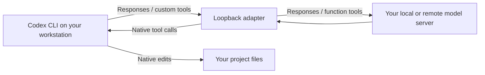

# Codex Local Bridge

[](https://github.com/lolren/codex-local-bridge/actions/workflows/tests.yml)
[](LICENSE)

Run **Codex CLI against your own model server with native file editing**. Includes the compatibility adapter, a portable installer, manual configuration, the model capability patch, diagnostics, and a real model smoke test.

Some local servers accept OpenAI Responses requests and function tools but omit Codex's custom `apply_patch` tool. Separately, a custom Codex model catalog may not enable that tool at all. This project handles both: it enables the native capability in Codex and translates the wire format for the server. Codex still applies edits on the computer where you run it, with its normal file-change display and configured permissions.



This is an independent community project, not an official OpenAI or vLLM release. It does not include model weights or a GPU server installer.

## Requirements and compatibility

- Linux, macOS, or WSL; **Python 3.11+**, Git, and Codex CLI. No Python packages are required.
- A server implementing **`POST /v1/responses` with streaming function calls** and `GET /v1/models`. An OpenAI-compatible **Chat Completions-only** endpoint is insufficient.
- A model and server chat template/parser that actually support tool calling.

The verified CLI baseline is **Codex 0.157.1**. The live integration was tested with vLLM serving [Qwen3.8-Flash-Next-W4A16-FP8PLE](https://huggingface.co/albucino/Qwen3.8-Flash-Next-W4A16-FP8PLE). Other Responses-compatible models may work; run the smoke test before relying on them. See [compatibility and test evidence](docs/compatibility.md).

## Quick start

Install the tested CLI version using a supported Node.js LTS installation:

```bash
npm install -g @openai/codex@0.157.1
codex --version

git clone https://github.com/lolren/codex-local-bridge.git
cd codex-local-bridge
```

Use your server's address and **the exact `id` returned by `/v1/models`**. The model ID may be a serving alias, not its Hugging Face name.

```bash
# Change this if your model runs on another machine.
export LOCAL_LLM_URL='http://127.0.0.1:8000/v1'
curl -fsS "$LOCAL_LLM_URL/models"

# Replace this placeholder with an id from the response above.
export LOCAL_LLM_MODEL='YOUR_SERVED_MODEL_ID'
python3 install.py \
  --upstream "$LOCAL_LLM_URL" \
  --model "$LOCAL_LLM_MODEL" \
  --context-window 32768

export PATH="$HOME/.local/bin:$PATH"
python3 scripts/doctor.py --start-bridge
```

Set the context to a value your **running server** supports. If it is configured for the full 262,144-token context, use `--context-window 262144`. This setting does not allocate KV cache or increase the server's limit. Add `--reasoning-effort medium` only if your server/model accepts that setting.

Open your project and start a fresh session:

```bash
cd /path/to/your/project
codex-local
```

The launcher starts the adapter automatically, selects the local provider and model explicitly, and uses an isolated `~/.codex-local` configuration. An unauthenticated local server needs no OpenAI account or API key. Your usual `~/.codex` configuration is not changed.

The default uses Codex's workspace sandbox and approval policy. If you deliberately want to disable both, the command is:

```bash
codex-local --yolo
```

`--yolo` gives model-generated commands unrestricted access under your user account. The adapter itself does not add an additional sandbox.

## Verify real native editing

From the cloned repository:

```bash
python3 -m unittest discover -v
python3 scripts/smoke_test.py --launcher "$HOME/.local/bin/codex-local"
```

The second command uses your model on a temporary project. It checks completed native file-change events for **add, update, and delete**, verifies the resulting files, and independently runs three original tests while checking that they were not changed. It fails if the model only describes changes or makes them exclusively through shell commands. Add `--yolo` only if you intend to run this test without Codex's sandbox and approvals.

## Installation options

| Option | Purpose |
| --- | --- |
| `--upstream URL` | Server root or `/v1` URL; remote servers are supported |
| `--model ID` | Exact served model ID |
| `--context-window N` | Codex context budget; must not exceed the server's limit |
| `--reasoning-effort VALUE` | Optional server-supported reasoning effort |
| `--api-key-env LOCAL_LLM_API_KEY` | Read your server token from this environment variable |
| `--port 18082` | Change the local adapter port; default is `18081` |
| `--codex /path/to/codex` | Select a specific installed CLI |
| `--prefix /path/to/install` | Put launcher, adapter, and Codex settings under one directory |
| `--name codex-other` | Change the launcher filename; use a separate prefix and port for another installation |
| `--systemd` | Linux: install and enable a user service at login instead of starting a background process on demand |
| `--dry-run` | Show planned file destinations without writing them |
| `--force` | Back up and replace existing generated files |

For authenticated servers, export the named variable before launching Codex; the token is not written into generated configuration. `--systemd` uses default per-user paths and cannot be combined with `--prefix`.

```bash
codex-local --bridge-status
codex-local --bridge-stop
```

Stopping the adapter interrupts active requests. It starts again the next time you run the launcher. Adapter health checks show whether the adapter is running; they do not mean that a model has loaded successfully.

## Everything in this repository

| File or guide | What it contains |
| --- | --- |
| [Manual installation](docs/manual-install.md) | Install Codex, configure a provider/catalog, run the adapter, and launch without the installer |
| [Backend setup](docs/backends.md) | vLLM requirements, remote URLs, authentication, model aliases, context, and other servers |
| [Why editing failed](docs/architecture.md) | Both root causes, upstream source references, and the request/history/SSE translations |
| [Native patch behavior](docs/native-editing.md) | Syntax, operation probes, overwrite/line-ending behavior, and failure limits |
| [Patches](patches/README.md) | Model catalog patch, provider routing diff, and the safe patch helper |
| [Troubleshooting](docs/troubleshooting.md) | Cloud-account errors, missing tools, bad routes, sandbox failures, and logs |
| [Operations](docs/operations.md) | File locations, user service, multiple models, upgrades, backup restoration, removal |
| [Compatibility](docs/compatibility.md) | Tested versions, actual live evidence, and limits |
| [Examples](examples/) | Copyable configuration, model catalog, and systemd service |
| [bridge.py](bridge.py) | Complete standard-library HTTP/SSE adapter |
| [install.py](install.py), [launcher.py](launcher.py) | Installer and explicit local-provider launcher |
| [scripts](scripts/) | Diagnostics, capability patcher, and real model smoke test |

There is no Codex binary fork to compile and no vLLM source patch to maintain. Hosted web search, image generation, computer-use services, and arbitrary model capabilities are not supplied by this adapter. [Contributions](CONTRIBUTING.md) with reproducible compatibility results are welcome.

## Upstream references

- [Official Codex CLI documentation](https://developers.openai.com/codex/cli)
- [Official advanced configuration](https://developers.openai.com/codex/config-advanced)
- [Official configuration reference](https://developers.openai.com/codex/config-reference)
- [Codex source at the tested release](https://github.com/openai/codex/tree/rust-v0.157.1)
- [vLLM's Codex integration guide](https://docs.vllm.ai/en/latest/serving/integrations/codex/)

Licensed under [MIT](LICENSE).
